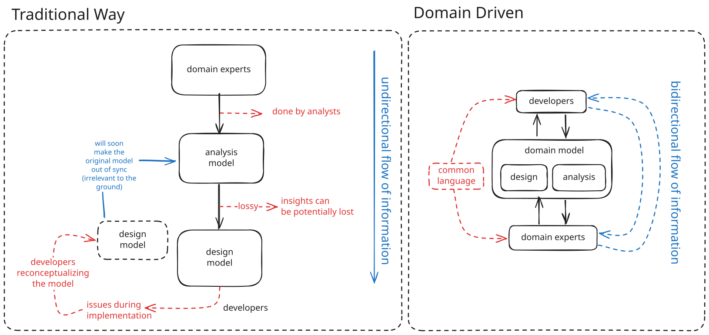

# Why DDD

- The single model reduces the chances of error, since the design is now a direct outgrowth of the carefully
considered model



- There should be a common language between the `developers` and the `domain experts`, Translation is always inaccurate and hides the disconnect between devs and experts. In case very few billingual people manages to talk to both `devs` and `domain experts`, however, they become the `bottleneck of information` and their translations are inexact.

- Translation muddles `model concepts`

### How should be this `Ubiquitous` Language?

- `Model` as backbone
- use same language in speaking, writing, and diagrams
- persistent use of language force its weaknesses into the open.
- Domain experts object to terms or structures that are awkward or inadequate to convey domain understanding.
- While developers watch for ambiguity or inconsistency that will trip up design.
- Resolve confusion in conversation, like as in converge on agreed meaning of ordinary words.
- Domains Experts **Needs** to understand the model, if they don't there is something wrong with the model.

### How should be modelling done effectively?

- UML can be a good starting point
- It should not be used to model the whole system
- It handles one half effectively (attributes and relationsips)
- but behaviour of objects and constraints on them cannot be easily illustrated
- the idea is to highlight some tricky hotspots in design
- for constraints and assertion, uml fall back on text, place in little brackets, inserted in diagram
- Behavioral responsibilities of an object can be hinted at through operations names, and implicitly
demonstrated with object interaction (or sequence) diagrams, but they cannot be stated. so use suplemental text or conversation.
- `explanatory model` and the `model that drives design` are different

### Why Analysis Model Fails?

- The developers are forced to reconceptualize the domain on their own, and there is no guarantee that the insights gained by the analysts and embedded in the model will be retained or rediscovered.
- Pure analysis model even falls short of its primary goal of understanding the domain, because crucial discoveries always emerge during the design/implementation effort as very specific problems are encountered that were not anticipated.

Domain Model should satisfy both objectives, analysis and design. 

## Associations

- one to many can be models with a collection/list type of property

```ts
type User = {
   id: string
   documents: List<Document>
}
```

- it can also be a accessor method that queries the database
```ts
interface User {
    id: string
    accessDocument(): IO<Option<Document>>
}
```

- Both of these designs would reflect the same model. The design has to specify a particular traversal mechanism whose behavior is consistent with the association in the model.

- many to many relationships are tricky as they are naturally bidirectional, but we can impose direction. for example, a `country` can have multiple `presidents`, and so with the other countries, but we may dicover from our domain that a person can be `president` to only one country. and so we reduce the traversal direction to `President -> Country`, George bush was president of what country?

## Services

- Services should be modeled with domain language
- Operation names should come from the UBIQUITOUS LANGUAGE or be introduced into it.
- Parameters and results should be domain objects.
- Execution of Services will use the information globally and might have side effects.
- service does not hold state of its own that affects its behavior, as most domain objects do
- represents significant process or transformation in the domain
- There is a difference between _Service in the domain layer_ and _Service in other layers_
- Most SERVICES discussed in the literature are the purely technical and belong in the infrastructure layer.
- Domain and application SERVICES collaborate with these services in infrastructure layer.
- Domain Service is when a service orchestrates logic between entities to get something done because entities are generally very fine grained to do anything useful beyond CRUD. for example, a service that makes a transaction from one account to another is a `domain service`
- Application Service is where we perform an operation that involves concept that has no meaning in the business logic or domain. for example, banking service to export transaction to excelsheet file is an `application service` because `file formats` has no meaning in the domain of banking and there is no businness rules involved.
- The **External Services** such as any calls to interbank network are usually dressed up as a **Facade**. Since it is awkward to make a direct interface between a domain object and external resources

## Modules

- Low coupling between them
- High Cohesion in the interior
- When choosing MODULES, focus on conceptual cohesion and telling the story of the system

## Aggregates

- each aggregate has a single root which is basically an entity.
- aggregate can have multiple entities
- entities within an aggregate can reference each other
- deletion of aggregate root should cleanup it's dependent entities
- invariants are consistency rules, applied when data changes
- invariants are strictly enforced within aggregate, with the end of a transaction
- invariants can get out of sync, unsatisfied when transaction span multiple aggregates.
- the out of sync should be updated with event or batch jobs, within a `specified` amount of time.
- aggregate root entity has a global identity
- entities within an aggregate have local identity (their identity is unique locally in aggregate, but it does not have to be unique globally)
- entities within an aggregate (other than root) cannot be referenced outside the aggregate
- root entities can be referenced by all entities.

## Factories

- FACTORY encapsulates the knowledge needed to create a complex object or AGGREGATE
- responsible for creating an entire aggregate, enforcing it's invariant
- entity factory vs value object factory
- Factory for creation
- Factory for reconstitution (from network or data store),

```ts
class UserFactory {
    reconstituteFromXML(xmlString: string): User
    reconstituteFromPGWireStream(pgwireStream: ArrayBuffer): User // for postgreSQL
    reconstituteFromTDS(TDS: ArrayBuffer): User // for MS SQL Server (uses Tabular Data Stream)
}
```

## Repositories

- Repository is basically a virtual interface that gives a illusion that it has a in-memory collection of specific type of objects.
- Repository manages the middle and end of a object lifecycle, while factories manages the start
- Regarding how Repository and Reconstitutional Factories are different, Repositories could _delegate_ reconstituion to Factories, however, it seldom happens in practice.
- Repoist

## References

- sometimes different models will exist to support different subsystems (see **Chapter 14,Maintaining Model Integrity**), sharing one set of concepts from analysis through all aspects of implementation within a given development effort.